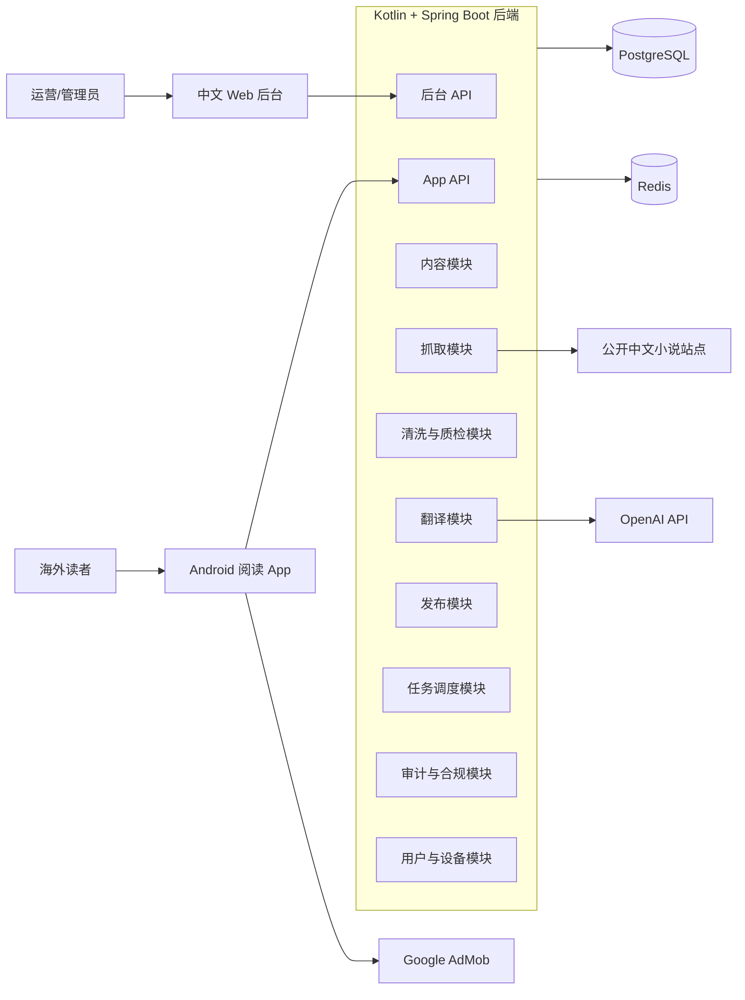
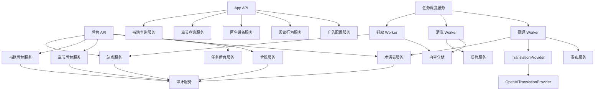
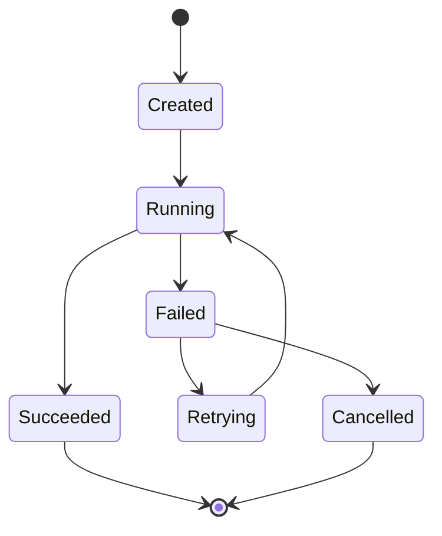
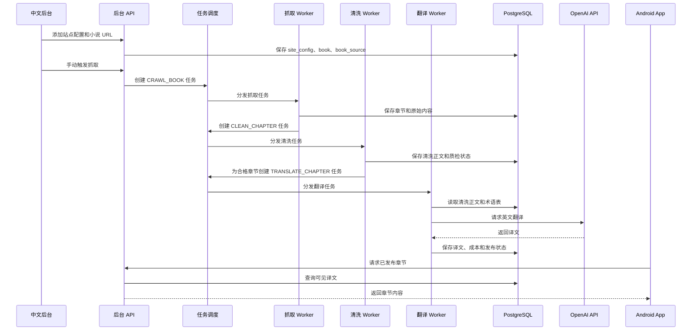
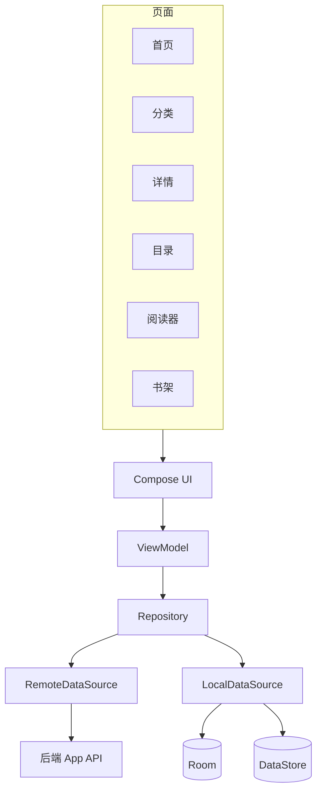
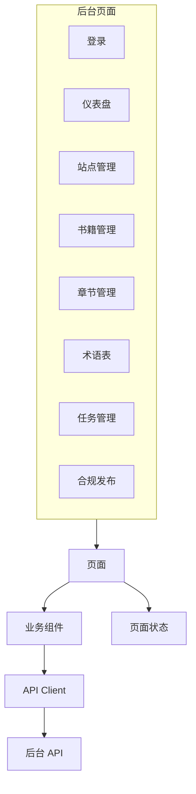
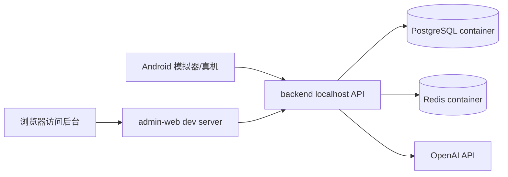

# 小说平台系统架构设计

## 1. 架构目标

本架构服务于小说平台 MVP，目标是用可控复杂度跑通“指定站点抓取 -> 文本清洗 -> AI 翻译 -> 自动发布 -> Android 阅读”的业务闭环。

架构重点：

- 支持 1-3 个公开小说站点和 10-30 本指定小说的 MVP 规模。
- 后端集中承载 API、内容管线、任务调度和状态管理。
- Web 后台负责运营配置、任务观察、术语维护和发布控制。
- Android App 只消费已发布内容，不直接感知抓取和翻译细节。
- 数据模型保留原文、清洗正文、译文和任务状态，便于重试、排错和下架。
- 预留多语言、多翻译供应商、登录同步和生产部署，但 MVP 不过度平台化。

## 2. 总体系统图



## 3. 客户端边界

### Web 后台

Web 后台是运营工作台，不直接执行抓取或翻译逻辑，只通过后台 API 创建配置、触发任务、查看状态和修改发布状态。

主要职责：

- 管理站点解析规则。
- 管理指定小说来源 URL。
- 查看章节抓取、清洗、翻译和发布状态。
- 维护术语表和待确认术语。
- 控制书籍/章节上线、隐藏和下架。
- 查看任务失败原因和审计日志。
- 配置广告、隐私政策、服务条款和版权投诉记录。

### Android App

Android App 是内容消费端，只读取已发布内容。

主要职责：

- 获取首页、分类、书籍详情、章节目录和章节内容。
- 本地保存书架、阅读进度、阅读设置和最近阅读。
- 预加载当前章和下一章。
- 做简单离线缓存。
- 读取后端广告配置并展示 AdMob 广告位。
- 上报匿名阅读行为。

Android App 不应直接访问：

- 站点配置。
- 抓取任务。
- 原始抓取内容。
- 清洗正文。
- 翻译任务。
- 后台审计日志。

## 4. 后端模块设计



### 内容模块

内容模块负责书籍、章节、分类、标签、封面、简介、发布状态和排序字段。

关键原则：

- 书籍和章节是业务主实体。
- 原始内容、清洗内容和译文分别存储。
- App API 只能查询已发布且未隐藏的内容。
- 后台 API 可以查看全状态内容。

### 抓取模块

抓取模块负责站点配置、来源 URL、抓取任务、解析规则、限速、并发和重试。

MVP 的解析规则可以先采用可配置选择器或站点级 Kotlin parser 实现。每个站点都必须独立配置请求限速和并发数，避免一个站点的问题影响全部任务。

### 清洗与质检模块

清洗模块把原始 HTML/文本转换为结构化段落。

质检模块判断章节是否允许自动翻译。异常章节进入 `needs_review` 或 `blocked`，由后台处理。

### 翻译模块

翻译模块通过 `TranslationProvider` 抽象供应商。MVP 只实现 OpenAI，但任务表记录 provider 和 model，避免后续切换供应商时改业务结构。

翻译模块负责：

- 获取章节清洗正文。
- 获取书籍术语表。
- 分块构造 prompt。
- 调用供应商。
- 合并译文。
- 记录 token、成本和失败原因。
- 翻译成功后通知发布模块。

### 发布模块

发布模块控制 App 可见性。

发布判断至少包含：

- 书籍发布状态。
- 章节发布状态。
- 语言。
- 是否隐藏。
- 是否下架。
- 是否存在合格译文。

### 用户与设备模块

MVP 使用匿名设备 ID，不强制登录。

该模块负责：

- 初始化匿名设备。
- 记录必要阅读行为。
- 为后续 Google 登录、书架同步和进度同步预留数据结构。

### 审计与合规模块

审计模块记录关键后台操作。

合规模块保存：

- 隐私政策 URL。
- 服务条款 URL。
- 广告披露。
- 版权投诉记录。
- 来源 URL 和抓取时间。

## 5. 数据存储设计

### PostgreSQL

PostgreSQL 是主存储，保存业务数据、内容、任务状态和审计日志。

核心数据域：

- 站点配置：`site_config`
- 书籍来源：`book_source`
- 书籍：`book`
- 章节：`chapter`
- 原始内容：`chapter_raw_content`
- 清洗内容：`chapter_clean_content`
- 译文：`chapter_translation`
- 分类标签：`taxonomy_category`、`taxonomy_tag`、`book_tag`
- 术语：`glossary_term`、`pending_glossary_term`
- 任务：`pipeline_task`
- 管理员：`admin_user`
- 审计：`audit_log`
- 匿名设备：`anonymous_device`
- 阅读行为：`reading_event`
- 广告配置：`ad_config`
- 合规配置：`compliance_config`
- 版权投诉：`copyright_complaint`

### Redis

Redis 在 MVP 中作为辅助能力，不作为必须持久化的业务真源。

建议用途：

- 任务锁。
- 同站点并发控制。
- 请求限速计数。
- 短期 App API 缓存。
- 定时任务防重入。

### 内容字段存储

章节正文建议按结构化段落保存，避免后续阅读器、翻译分块和质量检测重复解析文本。

可采用 JSONB 结构保存段落：

```json
{
  "title": "第一章 初入宗门",
  "paragraphs": [
    "段落一",
    "段落二"
  ]
}
```

## 6. 任务状态流



任务通用字段：

- `id`
- `type`
- `status`
- `priority`
- `target_type`
- `target_id`
- `payload`
- `retry_count`
- `max_retries`
- `failure_reason`
- `started_at`
- `finished_at`
- `created_at`

任务类型：

- `CRAWL_BOOK`
- `CRAWL_LATEST`
- `CRAWL_CHAPTER`
- `CLEAN_CHAPTER`
- `TRANSLATE_CHAPTER`
- `RETRANSLATE_CHAPTER`
- `PUBLISH_CHAPTER`

## 7. 内容管线数据流



## 8. App API 边界

App API 只返回读者可见数据。

建议接口：

- `POST /api/app/devices/anonymous`
- `GET /api/app/home`
- `GET /api/app/categories`
- `GET /api/app/books`
- `GET /api/app/books/{bookId}`
- `GET /api/app/books/{bookId}/chapters`
- `GET /api/app/chapters/{chapterId}`
- `GET /api/app/ad-config`
- `POST /api/app/reading-events`

App API 设计原则：

- 不暴露来源站点 URL。
- 不暴露原始中文内容，除非未来明确支持双语阅读。
- 不暴露后台任务状态。
- 章节内容只返回已发布译文。
- 广告配置由后端控制，App 只执行展示策略。

## 9. 后台 API 边界

后台 API 面向内部运营。

建议接口域：

- `/api/admin/auth`
- `/api/admin/dashboard`
- `/api/admin/sites`
- `/api/admin/books`
- `/api/admin/chapters`
- `/api/admin/glossary`
- `/api/admin/tasks`
- `/api/admin/categories`
- `/api/admin/recommendations`
- `/api/admin/compliance`
- `/api/admin/audit-logs`

后台 API 设计原则：

- 所有写操作记录审计日志。
- 手动触发抓取、清洗和翻译时只创建任务，不在 HTTP 请求内长时间执行。
- 列表接口需要分页。
- 任务失败原因需要可读。
- 下架和隐藏是软状态，不直接物理删除内容。

## 10. Android 本地架构



Android 分层：

- `ui`：Compose 页面和组件。
- `viewmodel`：页面状态和交互逻辑。
- `domain`：阅读器设置、书架、缓存策略等业务规则。
- `data.remote`：后端 API 调用。
- `data.local`：Room 和 DataStore。
- `data.repository`：合并远端和本地数据。

本地保存：

- 书架。
- 阅读进度。
- 阅读设置。
- 最近阅读。
- 简单章节缓存。

## 11. Web 后台前端架构



Web 后台建议使用 React + TypeScript + Vite。

前端边界：

- 页面只处理展示和用户交互。
- API Client 统一处理鉴权、错误和分页参数。
- 后台所有状态修改以服务端结果为准。
- 后台中文文案直接面向运营人员，避免过多技术术语。

## 12. 本地部署架构



本地开发建议：

- `deploy/docker-compose.yml` 启动 PostgreSQL 和 Redis。
- `backend/` 读取 `.env` 或环境变量。
- `admin-web/` 通过 dev server 访问后端。
- `android-app/` 使用 emulator 可访问的后端地址。
- OpenAI Key 只放在后端环境变量，不进入 App 或前端。

## 13. 可靠性与失败处理

### 抓取失败

处理策略：

- 记录失败原因。
- 按任务配置重试。
- 超过重试次数后进入失败状态。
- 后台允许手动重试。
- 同一站点失败率过高时可暂停该站点任务。

### 清洗失败

处理策略：

- 保存原始内容。
- 标记章节为 `needs_review` 或 `blocked`。
- 后台允许重新清洗。
- 不自动进入翻译。

### 翻译失败

处理策略：

- 记录 provider、model、token 估算和失败原因。
- 支持自动重试。
- 支持手动重翻译。
- 失败章节不自动发布。

### 发布异常

处理策略：

- App API 只读取明确发布状态的译文。
- 下架和隐藏立即影响 App 查询结果。
- 保留原文和译文，方便排查与恢复。

## 14. 安全与合规边界

MVP 不是完整合规系统，但需要从架构上避免后期硬伤。

必须满足：

- OpenAI Key 只保存在后端环境变量。
- App 不保存后台管理 token。
- 后台写操作需要登录。
- 后台关键操作写审计日志。
- App 使用匿名设备 ID，避免不必要个人信息采集。
- 广告披露、隐私政策 URL 和服务条款 URL 由后端配置。
- 书籍和章节支持下架、隐藏和删除标记。
- 保存来源 URL 和抓取时间。

版权风险说明：

公开站点抓取、翻译和发布存在版权风险。真实上架 Google Play 前，应确认内容授权，或至少建立公开投诉入口和明确的下架处理流程。

## 15. MVP 扩展点

后续扩展应沿以下边界进行：

- **多语言翻译**：扩展目标语言配置和 `chapter_translation` 语言维度。
- **多模型供应商**：新增 `TranslationProvider` 实现，不改变任务流。
- **Google 登录**：在用户与设备模块中绑定匿名设备和用户账号。
- **人工润色**：在译文发布前增加审核状态和编辑版本。
- **生产部署**：在 `deploy/` 基础上增加线上环境、监控、备份和 CI/CD。
- **个性化推荐**：基于 `reading_event` 建立推荐服务，不影响现有内容管线。

## 16. 架构验收标准

架构进入实现前应满足：

1. 后端模块边界覆盖抓取、清洗、翻译、发布、后台 API 和 App API。
2. App API 与后台 API 权限和数据边界清晰。
3. 原始内容、清洗内容和译文不会混存在同一状态字段里。
4. 任务状态支持重试、失败原因和手动重跑。
5. OpenAI 接入通过 Provider 抽象完成。
6. Android App 可以在不登录的情况下完成阅读闭环。
7. Web 后台可以完成运营闭环。
8. 下架、隐藏、广告配置和基础合规能力有明确模块承载。
